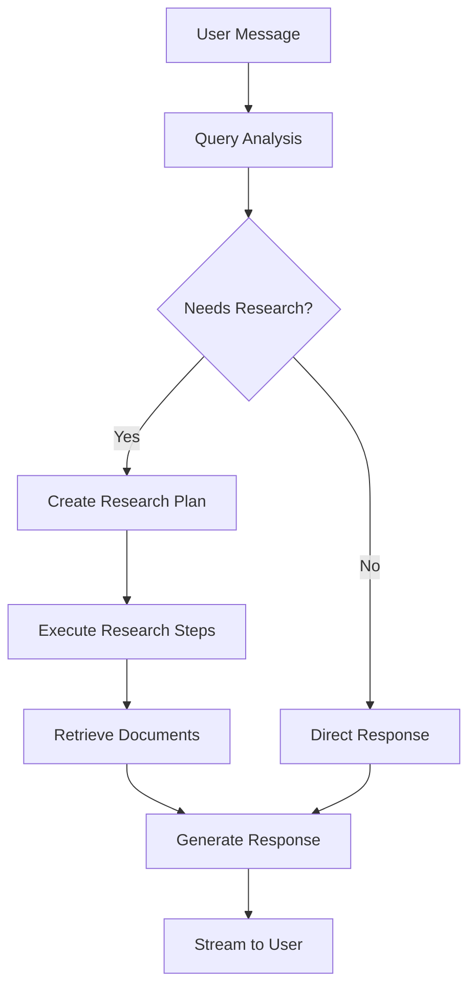

# User Management, Permissions, and Agent Configuration Guide

## Table of Contents
1. [User Management & Authentication](#user-management--authentication)
2. [Permissions & Access Control](#permissions--access-control)
3. [Prompt Management](#prompt-management)
4. [Agent Configuration](#agent-configuration)
5. [User Interactions with Agents](#user-interactions-with-agents)
6. [Production Considerations](#production-considerations)

---

## User Management & Authentication

### Current System Architecture

This LangChain chat system uses a **simple UUID-based user identification** system rather than traditional authentication:

#### How It Works:
- **No Login Required**: Users don't create accounts or sign in
- **Automatic User ID**: Each user gets a unique UUID automatically generated on first visit
- **Cookie Storage**: User ID is stored in browser cookies for session persistence
- **Thread Management**: User conversations are tied to their UUID

#### Technical Implementation:
```typescript
// frontend/app/hooks/useUser.tsx
export function useUser() {
  const [userId, setUserId] = useState<string>();

  useEffect(() => {
    const userIdCookie = getCookie(USER_ID_COOKIE_NAME);
    if (userIdCookie) {
      setUserId(userIdCookie);
    } else {
      const newUserId = uuidv4(); // Generate new UUID
      setUserId(newUserId);
      setCookie(USER_ID_COOKIE_NAME, newUserId);
    }
  }, []);

  return { userId };
}
```

### Setting Up Authentication (Optional Enhancement)

If you want to add proper authentication, consider these approaches:

#### Option 1: Add Traditional Auth
1. **Choose an Auth Provider**: Auth0, Firebase Auth, Supabase Auth, or NextAuth.js
2. **Replace UUID System**: Modify `useUser.tsx` to handle auth state
3. **Add Login/Logout**: Create authentication UI components
4. **Secure Threads**: Tie conversation threads to authenticated user IDs

#### Option 2: Add Simple Account Creation
1. **Email Verification**: Require email for account creation
2. **Phone Verification**: For additional security (recommended in production)
3. **Profile Management**: Allow users to manage their conversation history

---

## Permissions & Access Control

### Current State: No Role-Based Access

The system currently has **no traditional permissions or team management**:

- ✅ All users have the same access level
- ✅ No admin vs regular user distinction  
- ✅ No team/organization concepts
- ✅ Rate limiting handled at infrastructure level (see production setup)

### Adding Permissions (Implementation Guide)

If you need role-based access control, here's how to implement it:

#### 1. Database Schema Enhancement
```sql
-- Add to your Supabase/PostgreSQL database
CREATE TABLE user_profiles (
  id UUID PRIMARY KEY,
  email VARCHAR UNIQUE,
  role VARCHAR DEFAULT 'user', -- 'admin', 'user', 'viewer'
  organization_id UUID,
  created_at TIMESTAMP DEFAULT NOW()
);

CREATE TABLE organizations (
  id UUID PRIMARY KEY,
  name VARCHAR,
  plan VARCHAR DEFAULT 'free', -- 'free', 'pro', 'enterprise'
  max_users INTEGER DEFAULT 10
);
```

#### 2. Update User Hook
```typescript
// Enhanced useUser hook with roles
export function useUser() {
  const [user, setUser] = useState<{
    id: string;
    role: 'admin' | 'user' | 'viewer';
    organization?: string;
  }>();
  
  // Add role checking logic
  const hasPermission = (permission: string) => {
    // Implement permission logic
  };
  
  return { user, hasPermission };
}
```

#### 3. Add Permission Middleware
```typescript
// Protect API routes
export function withPermissions(handler: any, requiredRole: string) {
  return async (req: any, res: any) => {
    const user = await getUserFromRequest(req);
    if (!user || !hasRole(user, requiredRole)) {
      return res.status(403).json({ error: 'Insufficient permissions' });
    }
    return handler(req, res);
  };
}
```

---

## Prompt Management

### Current System: LangSmith Integration

The system uses **LangSmith** for centralized prompt management:

#### How Prompts Are Stored
```python
# backend/retrieval_graph/prompts.py
from langsmith import Client

client = Client()

# Prompts are fetched from LangSmith
ROUTER_SYSTEM_PROMPT = (
    client.pull_prompt("langchain-ai/chat-langchain-router-prompt")
    .messages[0]
    .prompt.template
)

RESPONSE_SYSTEM_PROMPT = (
    client.pull_prompt("langchain-ai/chat-langchain-response-prompt")
    .messages[0]
    .prompt.template
)
```

#### Available Prompt Types
The system uses these specialized prompts:

1. **Router Prompt** (`ROUTER_SYSTEM_PROMPT`)
   - Classifies user queries
   - Determines conversation flow routing

2. **Research Plan Prompt** (`RESEARCH_PLAN_SYSTEM_PROMPT`)
   - Breaks down complex queries into research steps
   - Plans multi-step information gathering

3. **Query Generation Prompt** (`GENERATE_QUERIES_SYSTEM_PROMPT`)
   - Generates search queries for document retrieval
   - Optimizes search effectiveness

4. **Response Prompt** (`RESPONSE_SYSTEM_PROMPT`)
   - Formats final answers
   - Incorporates retrieved context

5. **General Prompt** (`GENERAL_SYSTEM_PROMPT`)
   - Handles general conversational queries
   - Provides fallback responses

6. **More Info Prompt** (`MORE_INFO_SYSTEM_PROMPT`)
   - Requests clarification from users
   - Handles incomplete queries

### Adding/Modifying Prompts

#### Method 1: Through LangSmith Dashboard
1. **Access LangSmith**: Login to your LangSmith account
2. **Navigate to Prompts**: Find the prompts section
3. **Locate Existing Prompts**: Search for prompts like "chat-langchain-router-prompt"
4. **Create New Version**: Modify and save new versions
5. **Update References**: Change the prompt names in `prompts.py` if needed

#### Method 2: Direct Code Modification
```python
# backend/retrieval_graph/prompts.py

# Option 1: Use local prompts instead of LangSmith
CUSTOM_ROUTER_PROMPT = """
You are a helpful AI assistant that routes user queries.
Analyze the user's question and determine if it requires:
- General conversation
- Research and document retrieval  
- More information from the user

Respond with your classification and reasoning.
"""

# Option 2: Override specific prompts
def get_custom_prompt(prompt_type: str) -> str:
    custom_prompts = {
        "router": CUSTOM_ROUTER_PROMPT,
        "response": "Your custom response prompt here...",
    }
    return custom_prompts.get(prompt_type, "")
```

#### Method 3: Dynamic Prompt Loading
```python
# Add environment-based prompt selection
import os

def load_prompt(prompt_name: str) -> str:
    # Try environment variable first
    env_prompt = os.getenv(f"CUSTOM_{prompt_name.upper()}_PROMPT")
    if env_prompt:
        return env_prompt
    
    # Fall back to LangSmith
    return client.pull_prompt(f"langchain-ai/{prompt_name}").messages[0].prompt.template
```

---

## Agent Configuration

### LangGraph Agent Architecture

The system uses **LangGraph** to create a sophisticated multi-step agent:

#### Agent Components

1. **Query Analysis & Routing**
   - Analyzes user intent
   - Routes to appropriate handler
   - Determines if research is needed

2. **Research Planning**
   - Breaks complex queries into steps
   - Plans information gathering strategy
   - Identifies required data sources

3. **Document Retrieval**  
   - Searches vector database (Pinecone)
   - Retrieves relevant context
   - Processes Bubble.io data

4. **Response Generation**
   - Synthesizes information
   - Formats final answer
   - Provides source citations

#### Configuration Options

```python
# backend/retrieval_graph/configuration.py
@dataclass(kw_only=True)
class AgentConfiguration(BaseConfiguration):
    # Model Selection
    query_model: str = "anthropic/claude-3-5-haiku-20241022"
    response_model: str = "anthropic/claude-3-5-haiku-20241022"
    
    # Prompt Customization
    router_system_prompt: str = prompts.ROUTER_SYSTEM_PROMPT
    research_plan_system_prompt: str = prompts.RESEARCH_PLAN_SYSTEM_PROMPT
    response_system_prompt: str = prompts.RESPONSE_SYSTEM_PROMPT
    
    # Retrieval Settings
    retriever_provider: str = "pinecone"
    search_kwargs: dict = field(default_factory=dict)
```

### Customizing Agent Behavior

#### 1. Change AI Models
```python
# Update default models in configuration.py
query_model: str = "openai/gpt-4"  # For query analysis
response_model: str = "anthropic/claude-3-sonnet"  # For responses
```

#### 2. Modify Agent Flow
```python
# backend/retrieval_graph/graph.py
# Add new nodes to the agent graph
builder = StateGraph(AgentState, input=InputState, config_schema=AgentConfiguration)
builder.add_node("custom_validator")  # Add custom validation
builder.add_node("data_enricher")     # Add data enrichment
builder.add_edge("router", "custom_validator")  # Modify flow
```

#### 3. Add Custom Data Sources
```python
# Extend the document retrieval to include new sources
async def retrieve_custom_data(query: str) -> List[Document]:
    # Add your custom data retrieval logic
    # Could be APIs, databases, files, etc.
    pass
```

---

## User Interactions with Agents

### How Users Start Conversations

#### 1. Automatic Initialization
- Visit the chat interface
- System generates UUID automatically
- No explicit "start" action needed

#### 2. Suggested Questions
```typescript
// frontend/app/components/SuggestedQuestions.tsx
const suggestedQuestions = [
  "How do I use a RecursiveUrlLoader to load content from a page?",
  "How can I define the state schema for my LangGraph graph?",
  "How can I run a model locally on my laptop with Ollama?",
  "Explain RAG techniques and how LangGraph can implement them.",
];
```

#### 3. Thread Management
- Each conversation creates a unique thread
- Users can switch between conversation threads
- Thread history is preserved per user

### Agent Interaction Flow



### Advanced User Features

#### 1. Model Selection
Users can choose different AI models:
```typescript
// Available models configured in the frontend
const modelOptions = [
  "anthropic/claude-3-5-haiku-20241022",
  "openai/gpt-4o-mini",
  "openai/gpt-4"
];
```

#### 2. Feedback System
Users can provide thumbs up/down feedback:
```typescript
// Feedback gets sent to LangSmith for analytics
const sendFeedback = async (runId: string, score: number) => {
  await fetch('/api/runs/feedback', {
    method: 'POST',
    body: JSON.stringify({ runId, score })
  });
};
```

#### 3. Thread Sharing
Users can share conversation threads via URL:
```typescript
// Threads are shareable via URL parameters
const shareThread = (threadId: string) => {
  const url = `${window.location.origin}?threadId=${threadId}`;
  navigator.clipboard.writeText(url);
};
```

---

## Production Considerations

### Rate Limiting & Abuse Prevention

#### Current Infrastructure Protection
```terraform
# terraform/modules/chat_langchain_backend/main.tf
resource "google_compute_security_policy" "hub_web_noauth_lb_http" {
  rule {
    action = "throttle"
    rate_limit_options {
      conform_action = "allow"
      exceed_action  = "deny(429)"
      enforce_on_key = "IP"
      rate_limit_threshold {
        count        = 5000  # 5000 requests
        interval_sec = 60    # per minute
      }
    }
  }
}
```

#### Recommended Enhancements

1. **User-Level Rate Limiting**
```typescript
// Add to API middleware
const userRateLimit = new Map(); // userId -> { count, resetTime }

export function rateLimitMiddleware(req: any, res: any, next: any) {
  const userId = getUserId(req);
  const now = Date.now();
  
  const userLimit = userRateLimit.get(userId);
  if (userLimit && userLimit.count > 100 && userLimit.resetTime > now) {
    return res.status(429).json({ error: 'Rate limit exceeded' });
  }
  
  // Update count and continue
  next();
}
```

2. **Content Filtering**
```python
# Add to backend for prompt injection protection
def validate_user_input(message: str) -> bool:
    # Check for suspicious patterns
    # Implement content filtering
    # Return False if message should be blocked
    pass
```

3. **Authentication Requirements**
For production, consider requiring:
- Email verification for account creation
- Phone number verification for enhanced security
- API keys for programmatic access

### Monitoring & Analytics

#### LangSmith Integration
- All conversations automatically traced
- Performance metrics collected
- User feedback aggregated
- Error tracking included

#### Custom Analytics
```typescript
// Add custom event tracking
const trackUserInteraction = (event: string, data: any) => {
  // Send to your analytics service
  analytics.track(event, {
    userId,
    timestamp: Date.now(),
    ...data
  });
};
```

### Scaling Considerations

#### Database Optimization
- Index user IDs and thread IDs
- Archive old conversations
- Implement connection pooling

#### Vector Store Management  
- Monitor Pinecone usage and costs
- Implement document archival strategy
- Optimize embedding dimensions

#### Infrastructure
- Use CDN for frontend assets
- Implement horizontal scaling for backend
- Monitor and adjust rate limits based on usage

---

## Quick Setup Checklist

### For Development:
- [ ] Set up environment variables
- [ ] Configure LangSmith prompts
- [ ] Test user identification flow
- [ ] Verify agent responses

### For Production:
- [ ] Implement proper authentication
- [ ] Set up rate limiting  
- [ ] Configure monitoring/alerting
- [ ] Test abuse prevention measures
- [ ] Set up backup and recovery

### For Customization:
- [ ] Modify prompts in LangSmith
- [ ] Configure agent models
- [ ] Add custom data sources
- [ ] Implement organization management
- [ ] Set up role-based permissions

This system provides a powerful foundation for building sophisticated AI chat applications with minimal user management overhead while maintaining the flexibility to add enterprise features as needed.

---

## Practical Example: Customizing for Bubble.io Integration

Since you have Bubble.io data integrated (events, venues, products), here's how to customize the system specifically for your use case:

### 1. Custom Prompts for Bubble.io Data

#### Router Prompt Enhancement
```python
# backend/retrieval_graph/prompts.py
BUBBLE_ENHANCED_ROUTER_PROMPT = """
You are a helpful AI assistant for a venue and event booking platform.
Analyze the user's query and classify it into one of these categories:

1. **venue_inquiry**: Questions about specific venues, locations, amenities
   - Examples: "Tell me about Uluwatu villas", "What venues are in Bali?"
   
2. **event_inquiry**: Questions about events, activities, bookings
   - Examples: "What events are happening this weekend?", "How do I book an event?"
   
3. **product_inquiry**: Questions about products, services, pricing
   - Examples: "What products do you offer?", "How much does it cost?"
   
4. **general**: General conversation or questions not related to venues/events
   - Examples: "How does your platform work?", "What are your hours?"

For venue/event/product inquiries, set needs_research=true to search our database.
For general inquiries, set needs_research=false for direct response.

Respond with your classification and reasoning in JSON format.
"""

# Override the default router prompt
ROUTER_SYSTEM_PROMPT = BUBBLE_ENHANCED_ROUTER_PROMPT
```

#### Response Prompt for Venue Data
```python
VENUE_RESPONSE_PROMPT = """
You are an expert venue and event consultant. Use the provided context about venues, events, and products to give helpful, detailed responses.

When discussing venues:
- Highlight key amenities and features
- Mention location and accessibility
- Include pricing if available
- Suggest related events or products

When discussing events:
- Provide event details and timing
- Mention venue requirements
- Include booking information

Context from our database:
{context}

User question: {question}

Provide a comprehensive, helpful response that encourages engagement with our platform.
"""
```

### 2. Custom Suggested Questions for Your Domain

```typescript
// frontend/app/components/SuggestedQuestions.tsx
const suggestedQuestions = [
  "Tell me about Uluwatu villas and their amenities",
  "What events are happening in Bali this month?", 
  "How do I book a venue for a wedding ceremony?",
  "What products and services do you offer for events?",
  "Show me beachfront venues for corporate retreats",
  "What's included in your event planning packages?"
];
```

### 3. Enhanced Agent Configuration for Bubble.io

```python
# backend/retrieval_graph/configuration.py
@dataclass(kw_only=True)
class BubbleAgentConfiguration(AgentConfiguration):
    """Enhanced configuration for Bubble.io venue/event platform."""
    
    # Specialized prompts
    venue_system_prompt: str = field(
        default=VENUE_RESPONSE_PROMPT,
        metadata={"description": "Prompt for venue-related queries"}
    )
    
    # Search parameters optimized for venue/event data
    search_kwargs: dict = field(
        default_factory=lambda: {
            "k": 10,  # Retrieve more documents for comprehensive venue info
            "filter": None,  # Can be used to filter by venue type, location, etc.
        }
    )
    
    # Bubble.io specific settings
    bubble_data_priority: bool = field(
        default=True,
        metadata={"description": "Prioritize Bubble.io data in search results"}
    )
```

### 4. Custom Filtering for Different User Types

```typescript
// Add user type detection and customized experience
export function useUserPreferences() {
  const [userType, setUserType] = useState<'guest' | 'planner' | 'vendor'>('guest');
  
  const getCustomizedPrompt = (basePrompt: string) => {
    const customizations = {
      guest: "Focus on venue features, pricing, and booking process.",
      planner: "Provide detailed logistics, capacity, and vendor coordination info.",
      vendor: "Emphasize partnership opportunities and venue requirements."
    };
    
    return `${basePrompt}\n\nUser Context: ${customizations[userType]}`;
  };
  
  return { userType, setUserType, getCustomizedPrompt };
}
```

### 5. Location-Based Query Enhancement

```python
# backend/retrieval.py - Enhanced retriever for location queries
async def retrieve_venue_data(query: str, location_filter: str = None) -> List[Document]:
    """Enhanced retrieval that considers location context."""
    
    # Extract location from query if not provided
    if not location_filter:
        location_filter = extract_location_from_query(query)
    
    # Build search with location preference
    search_kwargs = {
        "k": 15,
        "filter": {"location": location_filter} if location_filter else None
    }
    
    # Search Bubble.io data with location priority
    results = await search_bubble_venues(query, **search_kwargs)
    return results

def extract_location_from_query(query: str) -> Optional[str]:
    """Extract location keywords from user query."""
    locations = ["bali", "uluwatu", "canggu", "seminyak", "ubud", "nusa dua"]
    query_lower = query.lower()
    
    for location in locations:
        if location in query_lower:
            return location
    return None
```

### 6. Business Intelligence Integration

```python
# Add analytics for business insights
def track_venue_inquiries(venue_name: str, user_id: str):
    """Track which venues users are most interested in."""
    analytics_data = {
        "event_type": "venue_inquiry",
        "venue_name": venue_name,
        "user_id": user_id,
        "timestamp": datetime.now().isoformat()
    }
    
    # Send to your analytics platform
    send_to_analytics(analytics_data)

def generate_popularity_insights():
    """Generate insights about most requested venues/events."""
    # Query analytics data
    # Return insights for business dashboard
    pass
```

### 7. Seasonal and Event-Based Customization

```python
# Dynamic prompt adjustment based on time/season
def get_seasonal_prompt_enhancement():
    """Add seasonal context to prompts."""
    current_month = datetime.now().month
    
    seasonal_context = {
        (12, 1, 2): "Focus on holiday season events and year-end celebrations.",
        (6, 7, 8): "Highlight wedding season venues and summer events.",
        (3, 4, 5): "Emphasize outdoor venues and spring festival options."
    }
    
    for months, context in seasonal_context.items():
        if current_month in months:
            return context
    
    return "Provide general venue and event information."
```

### 8. Integration with Bubble.io Workflow

```javascript
// Example: Trigger Bubble.io workflows from chat interactions
const triggerBubbleWorkflow = async (workflowName: string, data: any) => {
  const response = await fetch(`${BUBBLE_APP_URL}/api/1.1/wf/${workflowName}`, {
    method: 'POST',
    headers: {
      'Authorization': `Bearer ${BUBBLE_API_TOKEN}`,
      'Content-Type': 'application/json'
    },
    body: JSON.stringify(data)
  });
  
  return response.json();
};

// Example usage in chat flow
const handleVenueBookingRequest = async (venueId: string, userDetails: any) => {
  // Create a lead in Bubble.io when user shows booking interest
  await triggerBubbleWorkflow('create_venue_lead', {
    venue_id: venueId,
    user_details: userDetails,
    source: 'chat_bot'
  });
};
```

### 9. Testing Your Customizations

```bash
# Test venue-specific queries
curl -X POST http://localhost:3000/api/chat \
  -H "Content-Type: application/json" \
  -d '{
    "message": "Tell me about Uluwatu villas with ocean views",
    "user_id": "test-user-123"
  }'

# Test event queries  
curl -X POST http://localhost:3000/api/chat \
  -H "Content-Type: application/json" \
  -d '{
    "message": "What wedding venues do you have available in December?",
    "user_id": "test-user-123"
  }'
```

### 10. Performance Optimization for Bubble.io Data

```python
# Cache frequently requested venue data
from functools import lru_cache
import asyncio

@lru_cache(maxsize=100)
def get_popular_venues():
    """Cache popular venue data for faster responses."""
    # Return frequently requested venue information
    pass

# Async batch processing for multiple venue queries
async def batch_venue_lookup(venue_ids: List[str]) -> Dict[str, Any]:
    """Efficiently lookup multiple venues at once."""
    tasks = [get_venue_details(venue_id) for venue_id in venue_ids]
    results = await asyncio.gather(*tasks)
    return dict(zip(venue_ids, results))
```

This enhanced configuration turns your chat system into a powerful venue and event discovery platform that can handle complex queries about your Bubble.io data while providing a natural, conversational experience for users planning events or looking for venues. 