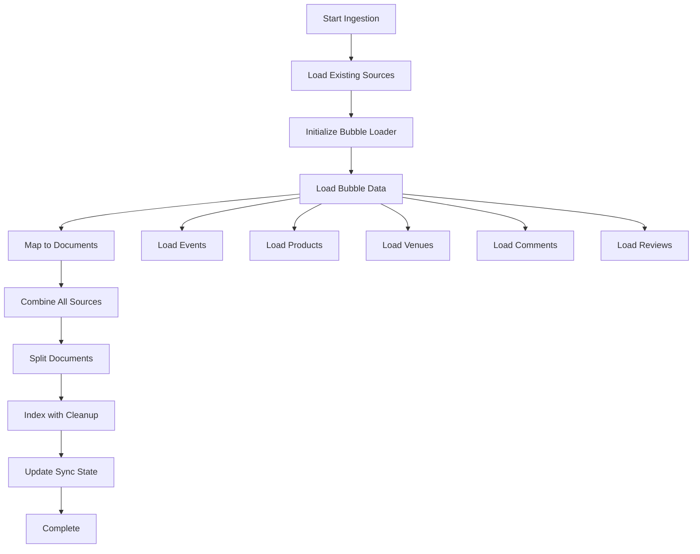

# Bubble.io Ingestion Pipeline Design

## Overview
This document outlines the architecture for integrating Bubble.io data into the existing LangChain chat system. The design extends the current `backend/ingest.py` system to include Bubble.io as a new data source while maintaining consistency with existing patterns.

## Current System Analysis

### Existing Architecture
```python
# Current ingest.py structure
def ingest_docs():
    # 1. Initialize vector store and record manager
    # 2. Load from multiple sources:
    #    - load_langchain_docs()
    #    - load_api_docs() 
    #    - load_langsmith_docs()
    #    - load_langgraph_docs()
    # 3. Split documents
    # 4. Process and index with cleanup
```

### Integration Points
- **Vector Store**: Pinecone (existing)
- **Record Manager**: SQLRecordManager (existing)
- **Text Splitter**: RecursiveCharacterTextSplitter (existing)
- **Embeddings**: get_embeddings_model() (existing)

## Bubble.io Integration Architecture

### 1. Core Components

#### BubbleDataLoader
```python
class BubbleDataLoader:
    """Main loader class for Bubble.io data integration"""
    
    def __init__(self, app_url: str, api_token: str):
        self.app_url = app_url
        self.api_token = api_token
        self.base_url = f"{app_url}/api/1.1/obj"
        self.headers = {"Authorization": f"Bearer {api_token}"}
        self.data_mapper = BubbleDataMapper()
        self.sync_manager = BubbleSyncManager()
    
    def load(self) -> List[Document]:
        """Load all Bubble.io data and convert to LangChain Documents"""
        pass
```

#### BubbleDataMapper
```python
class BubbleDataMapper:
    """Handles mapping Bubble.io records to LangChain Documents"""
    
    def map_record_to_document(self, record: Dict, data_type: str) -> Optional[Document]:
        """Convert a Bubble.io record to LangChain Document format"""
        pass
    
    def extract_content_fields(self, record: Dict, data_type: str) -> str:
        """Extract and combine content fields for page_content"""
        pass
    
    def extract_metadata(self, record: Dict, data_type: str) -> Dict:
        """Extract metadata for Document metadata field"""
        pass
```

#### BubbleSyncManager
```python
class BubbleSyncManager:
    """Manages incremental sync and state tracking"""
    
    def get_last_sync_time(self, data_type: str) -> datetime:
        """Get last successful sync time for data type"""
        pass
    
    def update_sync_time(self, data_type: str, sync_time: datetime):
        """Update last sync time after successful processing"""
        pass
    
    def get_updated_records(self, data_type: str, since: datetime) -> List[Dict]:
        """Fetch records updated since last sync"""
        pass
```

### 2. Integration Flow



### 3. Data Flow Architecture

#### Phase 1: Data Extraction
```python
def load_bubble_data() -> List[Document]:
    """Load data from Bubble.io API"""
    
    loader = BubbleDataLoader(
        app_url=os.environ["BUBBLE_APP_URL"],
        api_token=os.environ["BUBBLE_API_TOKEN"]
    )
    
    documents = []
    priority_data_types = ["event", "product", "venue", "comment", "eventreview"]
    
    for data_type in priority_data_types:
        try:
            # Get records updated since last sync
            records = loader.get_updated_records(data_type)
            
            # Convert to documents
            for record in records:
                doc = loader.data_mapper.map_record_to_document(record, data_type)
                if doc and validate_document_quality(doc):
                    documents.append(doc)
            
            logger.info(f"Loaded {len(records)} {data_type} records from Bubble.io")
            
        except Exception as e:
            logger.error(f"Error loading {data_type} from Bubble.io: {e}")
            continue
    
    return documents
```

#### Phase 2: Document Processing
```python
def process_bubble_documents(documents: List[Document]) -> List[Document]:
    """Process and enrich Bubble.io documents"""
    
    processed_docs = []
    
    for doc in documents:
        # Content quality check
        if len(doc.page_content.strip()) < 50:
            continue
            
        # Content sanitization
        doc.page_content = sanitize_content(doc.page_content)
        
        # Metadata enrichment
        doc.metadata.update({
            "content_length": len(doc.page_content),
            "processing_timestamp": datetime.now().isoformat(),
            "source_system": "bubble.io"
        })
        
        # Add to processed list
        processed_docs.append(doc)
    
    return processed_docs
```

#### Phase 3: Integration with Existing System
```python
def ingest_docs():
    """Updated ingest_docs function with Bubble.io integration"""
    
    # Existing setup
    PINECONE_API_KEY = os.environ["PINECONE_API_KEY"]
    PINECONE_INDEX_NAME = os.environ["PINECONE_INDEX_NAME"]
    RECORD_MANAGER_DB_URL = os.environ["RECORD_MANAGER_DB_URL"]

    text_splitter = RecursiveCharacterTextSplitter(chunk_size=4000, chunk_overlap=200)
    embedding = get_embeddings_model()

    pc = Pinecone(api_key=PINECONE_API_KEY)
    index = pc.Index(PINECONE_INDEX_NAME)
    vectorstore = PineconeVectorStore(index=index, embedding=embedding)

    record_manager = SQLRecordManager(
        f"pinecone/{PINECONE_INDEX_NAME}", db_url=RECORD_MANAGER_DB_URL
    )
    record_manager.create_schema()

    # Load from existing sources
    docs_from_documentation = load_langchain_docs()
    docs_from_api = load_api_docs()
    docs_from_langsmith = load_langsmith_docs()
    docs_from_langgraph = load_langgraph_docs()
    
    # NEW: Load from Bubble.io
    docs_from_bubble = load_bubble_data()
    logger.info(f"Loaded {len(docs_from_bubble)} docs from Bubble.io")

    # Combine all sources
    all_docs = (
        docs_from_documentation
        + docs_from_api
        + docs_from_langsmith
        + docs_from_langgraph
        + docs_from_bubble  # NEW
    )

    # Process documents
    docs_transformed = text_splitter.split_documents(all_docs)
    docs_transformed = [doc for doc in docs_transformed if len(doc.page_content) > 10]

    # Ensure metadata consistency
    for doc in docs_transformed:
        if "source" not in doc.metadata:
            doc.metadata["source"] = ""
        if "title" not in doc.metadata:
            doc.metadata["title"] = ""

    # Index with cleanup
    indexing_stats = index(
        docs_transformed,
        record_manager,
        vectorstore,
        cleanup="full",
        source_id_key="source",
        force_update=(os.environ.get("FORCE_UPDATE") or "false").lower() == "true",
    )

    logger.info(f"Indexing stats: {indexing_stats}")
```

## Implementation Details

### 1. Environment Configuration
```bash
# Add to environment variables
BUBBLE_APP_URL=https://app.bali.love
BUBBLE_API_TOKEN=your_private_api_key_here

# Optional: Bubble-specific settings
BUBBLE_SYNC_INTERVAL=3600  # 1 hour in seconds
BUBBLE_BATCH_SIZE=100      # Records per API call
BUBBLE_MAX_CONTENT_LENGTH=10000  # Max content length
```

### 2. Database Schema Extensions
```sql
-- Add Bubble.io sync tracking table
CREATE TABLE bubble_sync_state (
    id SERIAL PRIMARY KEY,
    data_type VARCHAR(50) NOT NULL,
    last_sync_timestamp TIMESTAMP WITH TIME ZONE,
    last_successful_count INTEGER DEFAULT 0,
    error_count INTEGER DEFAULT 0,
    created_at TIMESTAMP WITH TIME ZONE DEFAULT NOW(),
    updated_at TIMESTAMP WITH TIME ZONE DEFAULT NOW()
);

-- Create index for fast lookups
CREATE INDEX idx_bubble_sync_data_type ON bubble_sync_state(data_type);
```

### 3. Error Handling & Resilience
```python
class BubbleIngestionError(Exception):
    """Custom exception for Bubble.io ingestion errors"""
    pass

def safe_bubble_ingestion():
    """Wrapper for safe Bubble.io ingestion with error handling"""
    try:
        return load_bubble_data()
    except requests.exceptions.RequestException as e:
        logger.error(f"Bubble.io API connection error: {e}")
        return []  # Return empty list to continue with other sources
    except BubbleIngestionError as e:
        logger.error(f"Bubble.io ingestion error: {e}")
        return []
    except Exception as e:
        logger.error(f"Unexpected error in Bubble.io ingestion: {e}")
        return []
```

### 4. Monitoring & Metrics
```python
def track_bubble_metrics(documents: List[Document]):
    """Track metrics for Bubble.io ingestion"""
    
    metrics = {
        "total_documents": len(documents),
        "by_source_type": {},
        "avg_content_length": 0,
        "processing_time": time.time() - start_time
    }
    
    # Calculate metrics by source type
    for doc in documents:
        source_type = doc.metadata.get("source_type", "unknown")
        metrics["by_source_type"][source_type] = metrics["by_source_type"].get(source_type, 0) + 1
    
    # Calculate average content length
    if documents:
        total_length = sum(len(doc.page_content) for doc in documents)
        metrics["avg_content_length"] = total_length / len(documents)
    
    logger.info(f"Bubble.io ingestion metrics: {metrics}")
    return metrics
```

## Incremental Sync Strategy

### 1. Change Detection
```python
def get_incremental_updates(data_type: str, last_sync: datetime) -> List[Dict]:
    """Get only records that have changed since last sync"""
    
    # Use Bubble's modified_date field for filtering
    constraints = [
        {
            "key": "Modified Date",
            "constraint_type": "greater than",
            "value": last_sync.isoformat()
        }
    ]
    
    response = requests.get(
        f"{base_url}/{data_type}",
        headers=headers,
        params={
            "constraints": json.dumps(constraints),
            "limit": BATCH_SIZE
        }
    )
    
    return response.json().get("response", {}).get("results", [])
```

### 2. Batch Processing
```python
def process_in_batches(data_type: str, batch_size: int = 100):
    """Process large datasets in batches to avoid memory issues"""
    
    cursor = 0
    all_documents = []
    
    while True:
        response = requests.get(
            f"{base_url}/{data_type}",
            headers=headers,
            params={"cursor": cursor, "limit": batch_size}
        )
        
        data = response.json().get("response", {})
        results = data.get("results", [])
        
        if not results:
            break
            
        # Process batch
        batch_docs = [map_record_to_document(record, data_type) for record in results]
        batch_docs = [doc for doc in batch_docs if doc]  # Filter None values
        
        all_documents.extend(batch_docs)
        
        # Update cursor
        cursor += len(results)
        remaining = data.get("remaining", 0)
        
        if remaining == 0:
            break
            
        # Rate limiting
        time.sleep(0.5)
    
    return all_documents
```

### 3. Failure Recovery
```python
def recover_from_partial_failure(failed_data_types: List[str]):
    """Recover from partial ingestion failures"""
    
    logger.info(f"Attempting recovery for failed data types: {failed_data_types}")
    
    recovered_docs = []
    
    for data_type in failed_data_types:
        try:
            # Try with smaller batch size
            docs = process_in_batches(data_type, batch_size=20)
            recovered_docs.extend(docs)
            logger.info(f"Successfully recovered {len(docs)} documents from {data_type}")
            
        except Exception as e:
            logger.error(f"Recovery failed for {data_type}: {e}")
            continue
    
    return recovered_docs
```

## Testing Strategy

### 1. Unit Tests
```python
def test_bubble_data_mapper():
    """Test data mapping functionality"""
    
    sample_event = {
        "_id": "test123",
        "name": "Test Event",
        "description": "This is a test event description",
        "Created Date": "2024-01-01T00:00:00Z"
    }
    
    mapper = BubbleDataMapper()
    doc = mapper.map_record_to_document(sample_event, "event")
    
    assert doc is not None
    assert "Test Event" in doc.page_content
    assert doc.metadata["source_type"] == "event"
    assert doc.metadata["source"] == "bubble://event/test123"
```

### 2. Integration Tests
```python
def test_full_bubble_integration():
    """Test complete Bubble.io integration flow"""
    
    # Mock Bubble.io API responses
    with patch('requests.get') as mock_get:
        mock_get.return_value.json.return_value = {
            "response": {
                "results": [sample_event_data],
                "count": 1
            }
        }
        
        # Test integration
        docs = load_bubble_data()
        assert len(docs) > 0
        assert all(doc.metadata.get("source_system") == "bubble.io" for doc in docs)
```

### 3. Performance Tests
```python
def test_bubble_ingestion_performance():
    """Test performance with large datasets"""
    
    start_time = time.time()
    docs = load_bubble_data()
    processing_time = time.time() - start_time
    
    # Performance assertions
    assert processing_time < 300  # Should complete within 5 minutes
    assert len(docs) > 0
    
    # Memory usage check
    memory_usage = get_memory_usage()
    assert memory_usage < 1024 * 1024 * 1024  # Less than 1GB
```

## Deployment Checklist

### Prerequisites
- [ ] Bubble.io API access configured
- [ ] Environment variables set
- [ ] Database schema updated
- [ ] Dependencies installed

### Implementation Steps
- [ ] Create BubbleDataLoader class
- [ ] Implement BubbleDataMapper
- [ ] Add BubbleSyncManager
- [ ] Update ingest_docs() function
- [ ] Add error handling
- [ ] Implement monitoring
- [ ] Create unit tests
- [ ] Test with sample data
- [ ] Deploy to staging
- [ ] Validate in production

### Monitoring & Maintenance
- [ ] Set up alerting for ingestion failures
- [ ] Monitor API rate limits
- [ ] Track content quality metrics
- [ ] Regular sync state cleanup
- [ ] Performance monitoring

This design provides a comprehensive, production-ready architecture for integrating Bubble.io data into your existing LangChain chat system while maintaining reliability, performance, and maintainability. 